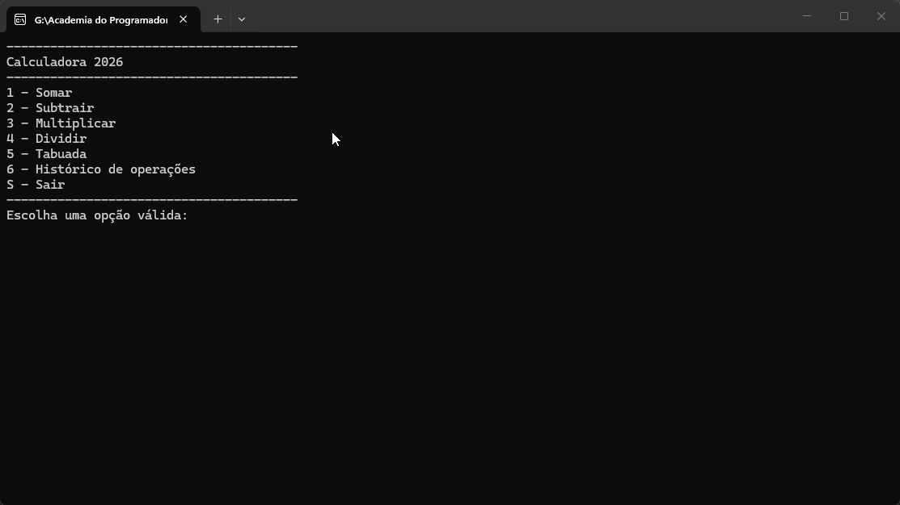

# Calculadora



## Projeto

Desenvolvido durante o curso Back-End da [Academia do Programador ](http://www.academiadoprogramador.net) 2026

## Introdução
Uma calculadora de console simples mas poderosa que permite realizar as quatro operações matemáticas, além da visualização do histórico de operações e a visualização da tabuada.


## Funcionalidades
- **Operações Básicas**: Implementado as 4 operações matemáticas (Soma, Subtração, Divisão, Multiplicação).
- **Tabuada**: Implementado a visualização da Tabuada.
- **Histórico de Operações**: Calculadora é capaz de armazenar na memória um histórico das operações anteriores.


## Como utilizar o programa

1. Clone ou baixe os arquivos do repositório.
2. Abra o seu emulador de terminal de preferência e navegue até a pasta raiz do projeto baixado.
3. Utilize o comando abaixo para restaura as dependências do projeto.


    ````
    dotnet restore
    ````

4. Em seguida compile e execute o projeto com o comando:

    ````
    dotnet run --project Calculadora.ConsoleApp
    ````

## Requisitos

- .NET 10 SDK